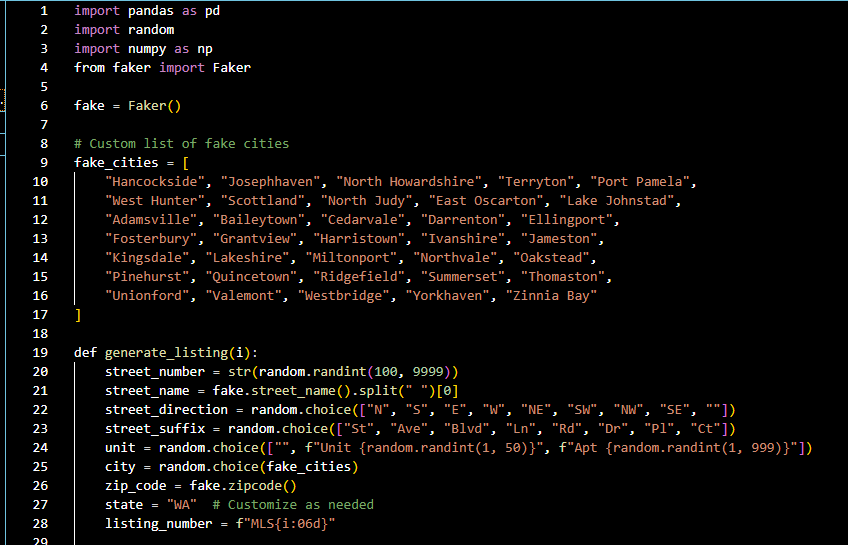

# Real Estate Analysis - Market Conditions

This project demonstrates the use of a synthetic real estate dataset to simulate MLS-style property listings for 2 made up counties and 24 fake cities. It involves data generation, database design, and analysis, all implemented using SQL in PostgreSQL. The project showcases SQL queries for real estate analysis, including property sales trends, price per square foot, and tax rate comparisons over a 6 month period. This analysis is geared for a home buyer looking to gain insight from this market data, or alternatively, a real estate PropTech company looking for more breadth in their analysis. 

## Project Overview

- **Synthetic Data Generation:** Used Python (Faker) to generate 1,000+ synthetic property listings, including property prices, locations, architectural styles, and transaction details.
- **Database Implementation:** Designed and implemented a PostgreSQL database in pgAdmin, where data was imported and structured into tables.
- **SQL Analysis:** Performed a series of analyses using SQL queries to answer key questions about the real estate market.

## Tools Used

- **Python (Faker, Pandas)** – For generating synthetic property listings.
- **PostgreSQL / pgAdmin** – For database implementation and SQL query execution.
- **SQL** – For data exploration, transformation, and analysis.

## Data Generation

The dataset contains over 1,000 property listings with details such as:

- Listing Number
- Property Address (Street, City, State, Zip Code)
- Property Features (Price, Bedrooms, Bathrooms, Square Footage, Lot Size)
- Sale Information (Original Price, Selling Price, Days on Market, etc.)
- Property Tax Data (Annual Taxes, Tax Rate)

A Python script was used to generate this data:

 

## Sample Analysis
 

**In this section, I pair my knowledge of real estate with my data analytic skills to assess various metrics related to the market at-large.**
 

## Query 1:
 

- To begin my analysis, I pulled the average price per square foot of all sold homes to get an idea of the overall pricing landscape:

  

 

## Query 2:

 

- I then pulled the average price of home, grouping each sold home into their respective city.:

 

 

- As demonstrated in the data, the average sold price is north of $700k for the top 10 cities, with one city being above $2 million.
- Evidently, that city had far fewer sales than the others in the table, rendering the data less statistically significant compared to the rest of the set.
- A WHERE clause ensuring the number of solds was above a certain number of sales would have eliminated the outlier.

 

## Query 3: 
  

- Now, knowing the average price ranges, I created a query to evaluate the average specs for homes per city.
- Doing this, one can gather an idea on the average home available by city.
- You can also cross-evaluate it against the avg price per home per city, or the avg price per sq ft.
  
 

## Query 4: 
 

- Next, I pulled the average consecutive days on market (CDOM) per city with the parameter that each city had over 30 sales during the 6 month span.
- This 30-sale parameter eliminates outliers.
- This provides a full-circle look at how fast or slow inventory is moving in any particular market. 

 

 

## Query 5:
 

- To assess the market further, I found the total dollar amount and percentage difference between the original listing price and the actual selling price (of that same home) and grouped by city.
- This query explores the market dynamics of each city. If the selling price is well under the original listing price, it suggests the market is cooling; if it is much higher, then it indicates a hot market.
- Understanding this relationship provides insight into how one can negotiate in a market.

 

 

- As you can see, every result indicates the homes are selling for under the original asking price.
- Given the statistically significant transaction total of Brucehaven, New Brian, , we can look at those differences to get a better gauge for the overall market.
- Most homes are selling for 

